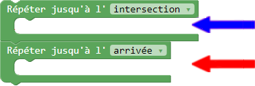

# Aide - Niveau 13

---

####Pour ce niveau, tu dois utiliser deux boucles !

---

Ce qui veut dire que les deux boucles devront être imbriquées une par dessus l'autre, comme ceci :

<table style="border: 1px;width: 60%;margin-left:22%">
<tr>
    <th></img></th>
    <th style="vertical-align: top">Ici, tu dois placer les commandes que Robotino doit répéter jusqu'à ce qu'il soit rendu à l'intersection
     Ici, tu dois placer les commandes que Robotino doit répéter jusqu'à ce qu'il soit rendu à l'arrivée
    </th>
</tr>
</table>
 
Étape afin de repérer les bouts de codes répétitifs :
<ol>
    <li style="margin-right: 5%;list-style-position: inside;text-align: center;font-weight: bold">Écrit le programme une fois sans utiliser de boucle</li>
    <li style="margin-left: 14.85%;list-style-position: inside;text-align: center;font-weight: bold">Repère l'endroit dans ton programme où Robotino devrait atteindre l'intersection</li>
    <li style="margin-left: 8%;list-style-position: inside;text-align: center;font-weight: bold">Regarde le code qui vient avant et repère le bout de code qui se répète</li>
    <li style="margin-left: 2.75%;list-style-position: inside;text-align: center;font-weight: bold">Place le bout de code qui se répète dans la boucle intersection</li>
    <li style="margin-left: 17%;list-style-position: inside;text-align: center;font-weight: bold">Regarde le code qui vient après l'intersection et repère le bout de code qui se répète</li>
    <li style="margin-right: 0.5%;list-style-position: inside;text-align: center;font-weight: bold">Place le bout de code qui se répète dans la boucle arrivée</li>

</ol>
Si ton programme contient plusieurs boucles, alors il y aura plusieurs bouts de code qui se répètent
## À ton tour d'essayer

[deux_boucles]: img/carte_deux_boucles.png
