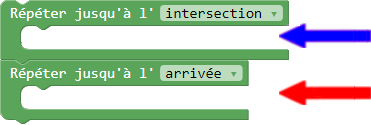

# Aide - Niveau 14

---

####Pour ce niveau, tu dois utiliser deux boucles !

---

Ce qui veut dire que les deux boucles devront être imbriquées une par dessus l'autre, comme ceci :

<table style="border: 1px;width: 60%;margin-left:22%">
<tr>
    <th></img></th>
    <th style="vertical-align: top">Ici, tu dois placer les commandes que Robotino doit répéter jusqu'à ce qu'il soit rendu à l'intersection
     Ici, tu dois placer les commandes que Robotino doit répéter jusqu'à ce qu'il soit rendu à l'arrivée
    </th>
</tr>
</table>
 
## À ton tour d'essayer

[deux_boucles]: img/carte_deux_boucles.png